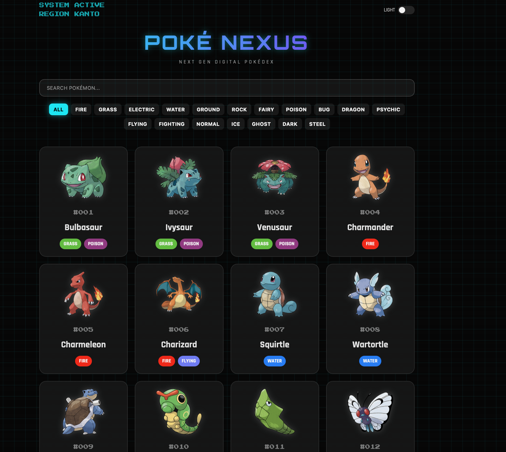

# PokéNexus - Retro Futuristic Pokédex

PokéNexus is a modern retro-inspired Pokédex web application built using HTML, CSS, and JavaScript. The project combines nostalgic Pokémon aesthetics with futuristic neon UI effects, glassmorphism design, animated cards, and responsive layouts.

## Preview

### Desktop View

---

## Features

- Dynamic Pokémon data using PokéAPI
- Search Pokémon by name or ID
- Pokémon type filters
- Responsive modern UI
- Retro arcade inspired design
- Neon glow animations
- CRT screen overlay effects
- Glassmorphism cards
- Dark/Light theme toggle
- Animated hover interactions
- Responsive for desktop and mobile devices

## Technologies Used

- HTML5
- CSS3
- JavaScript (Vanilla JS)
- PokéAPI

## Live Demo

https://pushpkumar-2602.github.io/Pokenexus-pokedex/

## GitHub Repository

https://github.com/pushpkumar-2602/Pokenexus-pokedex

## How to Run

1. Download the project
2. Open the folder
3. Run `index.html` in browser

OR

Use VS Code Live Server extension.

## Learning Outcomes

Through this project I learned:

- API integration using fetch()
- DOM manipulation
- Async JavaScript
- Responsive UI design
- CSS animations and effects
- Modern frontend development concepts

## Author

Pushp Kumar
